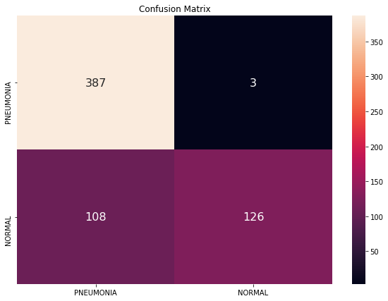

## Pneumonia Detection Using Deep Learning

#### 1. Introduction

Pneumonia is an infection that inflames your lungs' air sacs (alveoli). This repo is an basic implementation of pneumonia detection using Computer Vision based on Deep Learning

#### 2. Model Architecture

Fine tuning with pretrained Resnet-101 on ImageNet. Remove the original fully connected layer with output of 1000 classes by a similar layer with output of 2 classes

Step1: Freeze all layers's weights except the last fully connected layers and train with Adam optimizer

Step2: Unfreeze all layers's weights then continue train with smaller learning rate

#### 3. Dataset

Chest X-ray images (anterior-posterior) were selected from retrospective cohorts of pediatric patients of one to five years old from Guangzhou Women and Children’s Medical Center, Guangzhou. All chest X-ray imaging was performed as part of patients’ routine clinical care. This dataset is available on Kaggle.

Link: https://www.kaggle.com/paultimothymooney/chest-xray-pneumonia

#### 4.Result

Our model obtained some promising results. In particular, our model reaches **82% of accuracy and 99% of recall on pneumonia class !**. This is the confusion matrix affter evaluating on test set.

